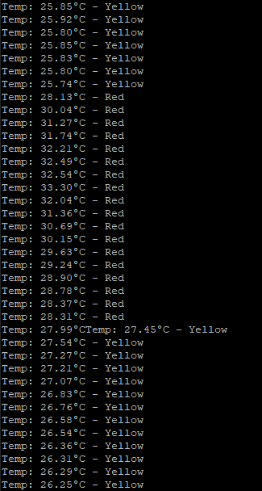
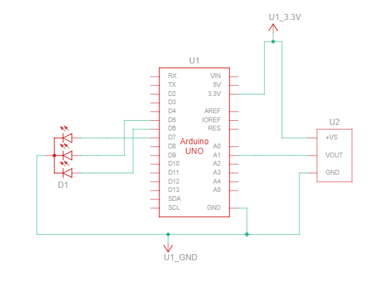

	# Assessment Submission Portfolio

**Assessment A1: Engine Compartment Monitor (Temperature & Status Display)**  
**Due:** Week 4 | **Weight:** 10%

---

## Version Control

| Field | Details |
|-------|---------|
| **Assessment Type** | Individual Portfolio Submission |
| **Assessment Code** | A1 |
| **Platform** | GitHub + Blackboard |
| **Document Version** | v1.0 |

---

## Introduction

This assessment submission form documents the completion of Assessment A1 (Engine Compartment Monitor). Your code and project work must be completed and committed to your GitHub portfolio repository in the `/A1-Electronics-Fundamentals/` folder.

**Important:** This form is for submission evidence only. Your actual code stays on GitHub.

---

## Submission Instructions

### Assessment Overview

Build an IoT device with temperature monitoring and status display using the following:
- **Thermistor (NTC 10kΩ)** for analog temperature sensing
- **RGB LED** for colour-coded status display (green/yellow/red)
- Temperature-to-colour mapping logic
- Serial output with temperature readings and colour state

### How to Complete This Assessment

1. Complete thermistor and RGB LED code in your `/A1-Electronics-Fundamentals/code/esp32-arduino/` folder
2. Test on breadboard or Wokwi simulation
3. Commit all files to GitHub
4. Fill out this form with your submission details
5. Copy completed form into Blackboard by the due date

### What to Submit on GitHub

- ✅ Arduino `.ino` file with thermistor reading and RGB LED control code
- ✅ Wiring diagram (Fritzing export or hand-drawn schematic)
- ✅ README.md describing thermistor wiring, ADC conversion, and colour logic
- ✅ Wokwi simulation link OR breadboard photo

---

## Student Information

| Field | Details |
|-------|---------|
| **Student Name** | Ben Timewell |
| **Student ID** | V093350 |
| **Assessment** | A1 – Engine Compartment Monitor |
| **Submission Date** | 30/03/2026 |

---

## Assessment Summary

### GitHub Portfolio Repository

| Field | Details |
|-------|---------|
| **Repository URL** | https://github.com/GebwellB/IoT-Portfolio |
| **Assessment Folder** | `/A1-Electronics-Fundamentals/` |
| **Code Location** | `/A1-Electronics-Fundamentals/code/esp32-arduino/` |
| **Last Commit Date** | 13/03/2026 |

### Work Completed

**Brief Description:**  
Describe which temperature range you achieved, what colours the LED displayed at each range, and any challenges with thermistor calibration.

For my thermistor and RGB LED setup, I have 4 ranges, 0-22°C (Blue), 22-24°C (Green), 24-28°C (Yellow) and 28°C+ (Red). While these numbers are rather low, they can be changed to match actual engine temperatures that would be in an engine, along with adjusting colours based on RGB values.  

A few challenges I ran into:  
1. The thermistor would take a long time to change with my thumb and finger to increase its temperature, sometimes it would only increase by 1-2 degrees, making testing very difficult. I did manage to get it as high as 32°C during testing, but I wasn't quick enough to capture that output or on video.
2. PIN mapping. I lost a fair chunk of time mapping my PINS to their hardware layout on the Pico W, not their GPIO PIN numbering. Rookie mistake, but lesson learnt. (seriously, why can't all the pins just go off the hardware layout, they are already numbered, why have two sets of numbers!)

---

## Assessment Evidence

### Code and Documentation

| Requirement | Evidence Provided | Location in Repository |
|-------------|-------------------|------------------------|
| Arduino `.cpp` file with thermistor and RGB LED code | ✔ Included | `/A1-Electronics-Fundamentals/code/esp32-arduino/src/main.cpp` |
| Thermistor ADC reading and temperature conversion | ✔ Working | Serial output in code |
| RGB LED PWM control | ✔ Working | analogWrite() in code |
| Temperature-to-colour mapping logic | ✔ Included | Code comments explain thresholds |
| Wiring diagram | ✔ Included | `/A1-Electronics-Fundamentals/media/WiringDiagram.PNG` |
| Assessment README.md | ✔ Included | `/A1-Electronics-Fundamentals/README.md` |

### Hardware Evidence

| Requirement | Evidence | Provided |
|-------------|----------|----------|
| **Wokwi Simulation** | Simulation link showing circuit and code working | ❌ No |
| **OR Breadboard Photo** | Photo of physical circuit with sensors wired | ✔ Yes |
| **Working System** | Screenshot of serial monitor showing sensor readings | ✔ Yes |

**Wokwi Link (if used):**  
N/A

**Breadboard Photo/Screenshot:**  
  
This shows the RGB LED changing from green (22-24°C) to yellow (24-28°C)

  
This shows the RGB LED changing from red (28°C+) to yellow (24-28°C)

  
This is the console output from the Pico showing live temperature readings

  
TinkerCAD didn't have a Raspberry Pi Pico to use, so I simulated it using an Arduino - I haven't tested this or coded it in TinkerCAD, but the wiring is the same, aside from PIN numbering and layout

---

## Assessment Evidence Checklist

Confirm all requirements completed before submitting:

| Requirement | Completed |
|-------------|-----------|
| Thermistor sensor reads temperature correctly | ✔ |
| Thermistor ADC values convert to °C via formula | ✔ |
| RGB LED displays green for normal temperature | ✔ |
| RGB LED displays yellow for warning temperature | ✔ |
| RGB LED displays red for critical temperature | ✔ |
| Serial output displays temperature readings | ✔ |
| Wiring diagram included and accurate | ✔ |
| Code is clean and commented | ✔ |
| GitHub repository is accessible | ✔ |
| Assessment README documents the work | ✔ |
| Hardware evidence provided (simulation or photo) | ✔ |

---

## Optional Notes

This was all done on a Raspberry Pi Pico W, using C++ and the Ardunio Libraries, but file structure is matched to ESP32 Arduino.

---

## Submission Declaration

By submitting this form, I confirm that:

- ✔ All code in my A1 folder is my own work
- ✔ Thermistor is correctly wired and functional
- ✔ RGB LED is correctly wired and functional
- ✔ Temperature-to-colour mapping logic is working
- ✔ Code follows ICTIOT502 assessment requirements
- ✔ I have not plagiarized or breached academic integrity

---

## For Assessor Use

| Field | Details |
|-------|---------|
| **Assessor Name** | [Assessor completes] |
| **Date Assessed** | [Assessor completes] |
| **Result** | ☐ Satisfactory ☐ Not Yet Satisfactory |
| **Feedback** | [Assessor completes] |

---

**Submission recorded by Blackboard:** [Auto-recorded]

**Your actual work is assessed on GitHub. This form provides proof of submission.**
