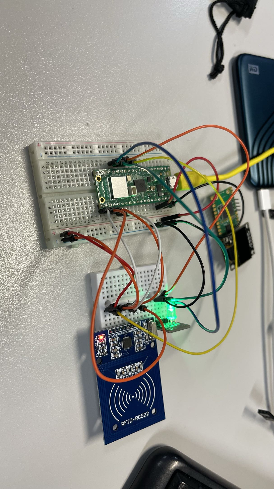
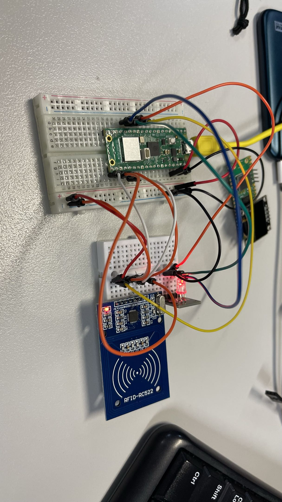
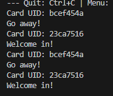

# Assessment Submission Portfolio

**Assessment A2: RFID Access Control System**  
**Due:** Week 6/7 | **Weight:** 10%

---

## Version Control

| Field | Details |
|-------|---------|
| **Assessment Type** | Individual Portfolio Submission |
| **Assessment Code** | A2 |
| **Platform** | GitHub + Blackboard |
| **Document Version** | v1.0 |

---

## Introduction

This assessment submission form documents the completion of Assessment A2 (RFID Access Control System). Your code and project work must be completed and committed to your GitHub portfolio repository in the `/A2-RFID-Access-Control/` folder.

**Important:** This form is for submission evidence only. Your actual code stays on GitHub.

---

## Submission Instructions

### Assessment Overview

Implement an RFID authentication system with audio feedback using:
- **RFID-RC522 module** reading multiple card types over SPI
- **Piezo buzzer** with distinct tones for granted / denied feedback
- **Green + red LEDs** as visual indicators
- **Serial output** logging all access events
- **Access control logic** to distinguish authorised vs. unauthorised cards

### How to Complete This Assessment

1. Complete RFID + buzzer code in `/A2-RFID-Access-Control/code/esp32-arduino/`
2. Test with multiple RFID cards and verify both tone patterns
3. Record Serial Monitor output showing 5+ access attempts (mix of granted/denied)
4. Commit all files to GitHub
5. Fill out this form with your submission details
6. Copy completed form into Blackboard by the due date

### What to Submit on GitHub

- ✅ `.ino` or `.py` file with RFID-RC522, buzzer, and LED code
- ✅ Serial Monitor screenshot/log showing 5+ access attempts
- ✅ README.md explaining RFID setup, authorised card UIDs, and SPI vs I²C paragraph
- ✅ Breadboard photo showing RFID, buzzer, and LED wiring
- ✅ Demo video (2 min) showing both tone patterns

---

## Student Information

| Field | Details |
|-------|---------|
| **Student Name** | Ben Timewell |
| **Student ID** | V093350 |
| **Assessment** | A2 – RFID Access Control |
| **Submission Date** | 30/03/2026 |

---

## Assessment Summary

### GitHub Portfolio Repository

| Field | Details |
|-------|---------|
| **Repository URL** | https://github.com/GebwellB/IoT-Portfolio |
| **Assessment Folder** | `/A2-RFID-Access-Control/` |
| **Code Location** | `/A2-RFID-Access-Control/code/esp32-arduino/` or `code/pico-micropython/` |
| **Last Commit Date** | 30/03/2026 |

### Work Completed

**Brief Description:**  
Describe your RFID access control system: how many authorised cards, what tones you chose for granted/denied, and how you distinguish cards.

I have two total cards, a blue (Aldi shopping trolley) Token, and a white RFID card. Only the white card is in the allowed array. When either is scanned, an RGB light will show green for valid, or flash red for invalid.

---

## Assessment Evidence

### Code and Documentation

| Requirement | Evidence Provided | Location in Repository |
|-------------|-------------------|------------------------|
| `.ino` or `.py` file with RFID + buzzer code | ✅ Included | `/A2-RFID-Access-Control/code/main.cpp` |
| RFID-RC522 reading multiple cards (SPI) | ✅ Working | Serial output shows card UIDs |
| Distinct **granted tone** (rising, two notes) | ❌ Opted for RGB light only | Demo video / serial log |
| Distinct **denied tone** (alarm pattern, 3× low) | ❌ Opted for RGB light only | Demo video / serial log |
| Green + red LED indicators | ✅ Working | Breadboard photo |
| Serial log with 5+ access attempts (mix granted/denied) | ✅ Included | Screenshot in assessment folder |
| SPI vs I²C paragraph in README | ✅ Included | `/A2-RFID-Access-Control/README.md` |

### SPI vs I²C

I2C is a two wire communication protocol that is mainly used to connect low speed devices together, where SPI is a four wire communication protocol. While I2C is slower, it only requires two wires from a microcontroller, where SPI needs four, three of which are common, but one is a direct connection from the microcontroller, this limits you to the number of devices the microcontroller can connect to, where I2C, your limitation is hardware addressing and hardware address conflicts and how quickly you want to receive the data from the sensors, meaning more sensors will slow the entire data gathering stage down.

Generally speaking, you would use I2C when you have many low speed devices, like sensors, and you'd use SPI when you need high speed / precise timing devices, such as displays.

### Hardware Evidence

| Requirement | Evidence | Provided |
|-------------|----------|----------|
| **Breadboard Photo** | Photo showing RFID-RC522, buzzer, and LEDs wired correctly | ✅ Yes |
| **Serial Log Screenshot** | 5+ access attempts showing granted and denied | ✅ Yes |
| **Demo Video** | 2 min showing both tone patterns, LEDs responding | ✅ Yes |

**Breadboard Photo/Screenshot:**  

This is the working wired up breadboard, with a working RGB light when a card is read. Green to show when the card is allowed and red when the card is denied.

**Sample Serial Log Entry:**  
  
This console output shows valid and invalid cards, all stored within an array

---

## Assessment Evidence Checklist

Confirm all requirements completed before submitting:

| Requirement | Completed |
|-------------|-----------|
| RFID-RC522 reads card UIDs correctly over SPI | ✅ |
| Authorised cards are identified and granted | ✅ |
| Unauthorised cards are rejected | ✅ |
| Distinct **granted** tone plays on authorised card | ❌ (RGB Light only)|
| Distinct **denied** tone plays on unauthorised card | ❌ (RGB Light only)|
| Green LED lights on granted, red on denied | ✅ |
| Serial output logs each access attempt | ✅ |
| SPI vs I²C paragraph included in README | ✅ |
| Code is clean and commented | ✅ |
| GitHub repository is accessible | ✅ |
| Breadboard photo shows all connections | ✅ |
| Demo video shows both tone patterns | ❌ (RGB Light only) |

---

## Optional Notes

Cards used:
| Card Type | UID |
|-------------|-----------|
| Blue token | bcef454a |
| White card | 23ca7516 |

Granted access is done by checking if the authorised card is within an array of all valid cards. This does require manual update if a new card needs access, which can be a pain if a new card is added to an existing truck, but if the truck is offline, it won't get the update to allow the new card.

---

## Submission Declaration

By submitting this form, I confirm that:

- ✅ All code in my A2 folder is my own work
- ✅ RFID-RC522 module is correctly wired and functional
- ❌ Buzzer tones for granted and denied are distinct and working (opted for only RGB light)
- ✅ Code follows ICTIOT502 assessment requirements
- ✅ I have not plagiarised or breached academic integrity

---

## For Assessor Use

| Field | Details |
|-------|---------|
| **Assessor Name** | [Assessor completes] |
| **Date Assessed** | [Assessor completes] |
| **Result** | ☐ Satisfactory ☐ Not Yet Satisfactory |
| **Feedback** | [Assessor completes] |

---

**Submission recorded by Blackboard:** [Auto-recorded]

**Your actual work is assessed on GitHub. This form provides proof of submission.**