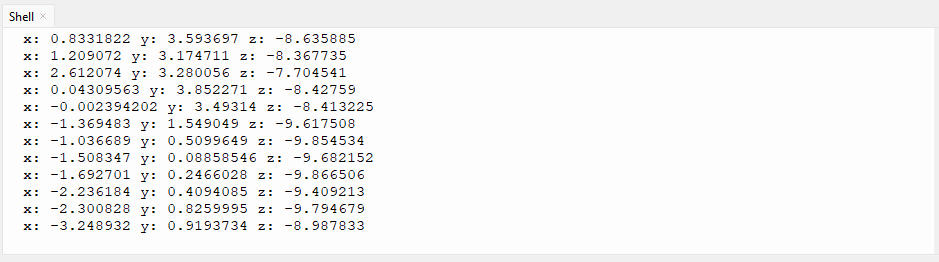
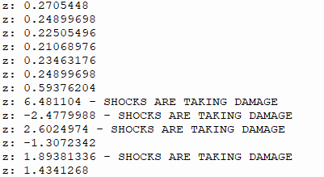
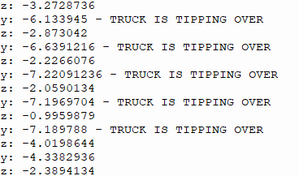
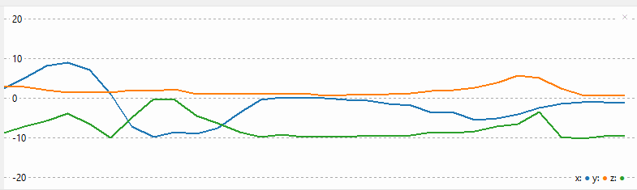

# Assessment Submission Portfolio

**Assessment A3: Vibration Monitoring System**  
**Due:** Week 8 | **Weight:** 10%

---

## Version Control

| Field | Details |
|-------|---------|
| **Assessment Type** | Individual Portfolio Submission |
| **Assessment Code** | A3 |
| **Platform** | GitHub + Blackboard |
| **Document Version** | v1.0 |

---

## Introduction

This assessment submission form documents the completion of Assessment A3 (Vibration Monitoring). Your code and project work must be completed and committed to your GitHub portfolio repository in the `/A3-Vibration-Monitoring/` folder.

**Important:** This form is for submission evidence only. Your actual code stays on GitHub.

---

## Submission Instructions

### Assessment Overview

Implement a vibration monitoring system using an accelerometer for predictive maintenance:
- **GY-521 (MPU6050)** measuring X, Y, Z acceleration on 3 axes
- **Moving average filtering** to reduce sensor noise
- **Threshold detection** for abnormal vibration patterns
- **CSV data file** with 60 seconds of filtered readings

### How to Complete This Assessment

1. Complete accelerometer code in `/A3-Vibration-Monitoring/code/MicroPython/`
2. Implement moving average filter for noise reduction
3. Set vibration thresholds and log anomalies
4. Collect 60 seconds of data and export to CSV
5. Commit all files to GitHub
6. Fill out this form with your submission details
7. Copy completed form into Blackboard by the due date

### What to Submit on GitHub

- ✅ MicroPython `.py` file with GY-521 accelerometer code
- ✅ CSV data file with 60 seconds of X, Y, Z acceleration readings
- ✅ README.md explaining filtering and threshold logic

---

## Student Information

| Field | Details |
|-------|---------|
| **Student Name** | Ben Timewell |
| **Student ID** | V093350 |
| **Assessment** | A3 – Vibration Monitoring |
| **Submission Date** | 20/04/2026 |

---

## Assessment Summary

### GitHub Portfolio Repository

| Field | Details |
|-------|---------|
| **Repository URL** | https://github.com/GebwellB/IoT-Portfolio |
| **Assessment Folder** | `/A3-Vibration-Monitoring/` |
| **Code Location** | `/A3-Vibration-Monitoring/code/esp32-arduino/` |
| **Last Commit Date** | 20/04/2026 |

### Work Completed

**Brief Description:**  
Describe your vibration monitoring system: which axes you measured, what filtering you applied, and what vibration thresholds trigger alerts.

I have measured the Z axis, with a filter of +1.5 and -1.5 from starting point. Anything over or under these amounts, will trigger an alert to show the truck is taking significant vibrations

Console Output - All Axis

  
Console Output - Filtered for Z

  
Console Output - Filtered for Y & Z

Graph Output - All Axis

---

## Assessment Evidence

### Code and Documentation

| Requirement | Evidence Provided | Location in Repository |
|-------------|-------------------|------------------------|
| Arduino `.py` file with GY-521 code | ✔️ Included | `/A3-Vibration-Monitoring/code/esp32-arduino/` |
| Y, Z acceleration measurements | ✔️ Working | Raw values logged to serial |
| Moving average filter implementation | ✔️ Included | Code comments explain filter window |
| Threshold detection for anomalies | ✔️ Included | Thresholds defined for Y, Z axes |
| Assessment README.md | ✔️ Included | `/A3-Vibration-Monitoring/README.md` |

### Hardware Evidence

| Requirement | Evidence | Provided |
|-------------|----------|----------|
| **Working System** | Screenshot of serial monitor showing sensor values and anomalies | ✔️ Yes |

---

## Assessment Evidence Checklist

Confirm all requirements completed before submitting:

| Requirement | Completed | Notes |
|-------------|-----------|-------|
| GY-521 sensor reads X, Y, Z acceleration | ✔️ | Code only reads Y & Z axis
| Moving average filter reduces noise | ✔️ | Filter only detects anomalies
| Filtered values are noticeably smoother than raw | ✔️ | Filter only detects anomalies
| Threshold detection identifies anomalies | ✔️ |
| Code is clean and commented | ✔️ |
| GitHub repository is accessible | ✔️ |
| Assessment README documents filter parameters and thresholds | ✔️ |

---

## Optional Notes

Had many issues with hardware with this assessment. Mocked a lot of data to get filters to work, ended up having to use MicroPython as C had constant issues reading data from the MPU.

---

## Submission Declaration

By submitting this form, I confirm that:

- ✔️ All code in my A3 folder is my own work
- ✔️ GY-521 accelerometer is correctly wired and functional
- ✔️ Moving average filter is properly implemented
- ✔️ Threshold detection logic works as designed
- ✔️ Code follows ICTIOT502 assessment requirements
- ✔️ I have not plagiarized or breached academic integrity

---

## For Assessor Use

| Field | Details |
|-------|---------|
| **Assessor Name** | [Assessor completes] |
| **Date Assessed** | [Assessor completes] |
| **Result** | ☐ Satisfactory ☐ Not Yet Satisfactory |
| **Feedback** | [Assessor completes] |

---

**Submission recorded by Blackboard:** [Auto-recorded]

**Your actual work is assessed on GitHub. This form provides proof of submission.**
