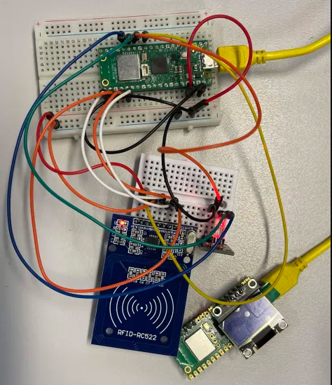
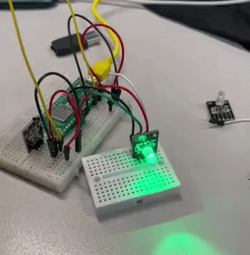
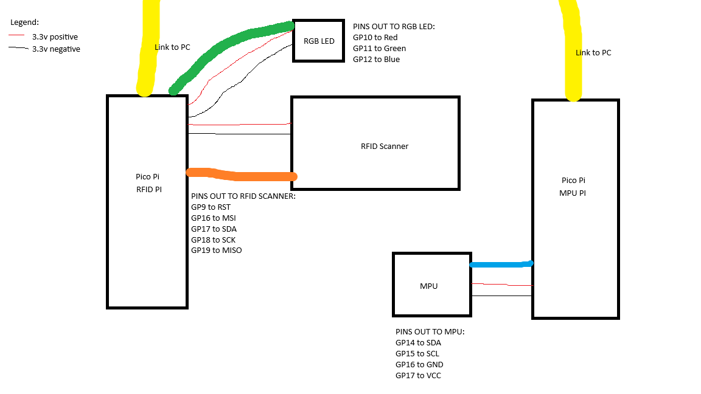

# Assessment Submission Portfolio

**Assessment A4: Complete Haul Truck Device**  
**Due:** Week 9 | **Weight:** 15%

---

## Version Control

| Field | Details |
|-------|---------|
| **Assessment Type** | Individual Portfolio Submission |
| **Assessment Code** | A4 |
| **Platform** | GitHub + Blackboard |
| **Document Version** | v1.0 |

---

## Introduction

This assessment submission form documents the completion of Assessment A4 (Complete Haul Truck Device). This is the capstone hardware project integrating all sensors, actuators, and I²C peripherals from A1-A3.

**Important:** This form is for submission evidence only. Your actual code stays on GitHub.

---

## Submission Instructions

### Assessment Overview

Integrate all previous sensors and add actuators/displays to create a complete haul truck monitoring system:

**Integrated Components:**
- ✅ DHT11 (temperature/humidity) - from A1
- ✅ MQ-2 (gas sensor) - from A1
- ✅ Flame sensor - from A1
- ✅ RFID-RC522 + DS3231 RTC - from A2
- ✅ GY-521 accelerometer - from A3
- ✅ RGB LED (status indicator)

**Requirements:**
- Clean, modular code with functions
- Comprehensive Fritzing diagram or breadboard photo
- README.md documenting all components and pinouts
- 5-minute demonstration video

### How to Complete This Assessment

1. Integrate all A1-A3 sensors into `/A4-Haul-Truck-Integration/code/esp32-arduino/`
2. Add LED control
3. Organise code with functions for each subsystem
4. Create/photograph complete circuit
5. Commit all files to GitHub
6. Fill out this form with your submission details
7. Copy completed form into Blackboard by the due date

### What to Submit on GitHub

- ✅ Complete Arduino `.ino` file with all sensors and actuators
- ✅ Fritzing circuit diagram (PNG) or breadboard photo
- ✅ README.md with component list, pins, and system overview

---

## Student Information

| Field | Details |
|-------|---------|
| **Student Name** | Ben Timewell |
| **Student ID** | V093550 |
| **Assessment** | A4 – Complete Haul Truck Device |
| **Submission Date** | 11/05/2026 |

---

## Assessment Summary

### GitHub Portfolio Repository

| Field | Details |
|-------|---------|
| **Repository URL** | https://github.com/GebwellB/IoT-Portfolio |
| **Assessment Folder** | `/A4-Haul-Truck-Integration/` |
| **Code Location** | `/A4-Haul-Truck-Integration/code/` |
| **Last Commit Date** | 11/05/2026 |

### Work Completed

**Brief Description:**  
Summarize your complete truck system: all integrated sensors, how alerts trigger the buzzer, and servo operation.

My truck has 3 sensors attached. The engine temperature, the RFID access control and the MPU sensor for sensing when the truck is tipping / shocks are taking damage. These have different alert thresholds.  

The engine temperature will alert if over 50 degrees.  
The MPU will alert if there's too much movement in the shocks in a short amount of time, as well as if the truck is tilted more than 45 degrees.  
And the RFID access control simply alerts if the card tapped is allowed to enter or not.

---

## Assessment Evidence

### Code and Documentation

| Requirement | Evidence Provided | Location in Repository |
|-------------|-------------------|------------------------|
| Complete Arduino `.py` file | ✅ Included | `/A4-Haul-Truck-Integration/code/AWS Sender/json_constructor.py` |
| All A1-A3 sensors integrated | ✅ Working | DHT11, RFID, accelerometer |
| RGB LED status indicator | ✅ Working | LED changes color based on system state |
| Modular code with functions | ✅ Included | Code organized by subsystem |
| Circuit diagram (Fritzing) | ✅ Included | PNG in assessment folder |
| Assessment README.md | ✅ Included | `/A4-Haul-Truck-Integration/README.md` |

### Hardware & Demonstration Evidence

| Requirement | Evidence | Provided |
|-------------|----------|----------|
| **Circuit Diagram** | Fritzing diagram showing all components and wiring | ✅ Yes |
| **OR Breadboard Photo** | High-quality photo of complete circuit | ✅ Yes |
| **Component List** | README lists all sensors, and pin assignments | ✅ Yes |

**Circuit Diagram/Breadboard Photo:**  
  
RFID and MPU sensors, connected to my PC for serial output

  
This is my original engine temp sensor

  
Tinkercad didn't have the right devices to make it there, so heres a wonderful MS paint wiring diagram!

---

## Assessment Evidence Checklist

Confirm all requirements completed before submitting:

| Requirement | Completed |
|-------------|-----------|
| DHT11 sensor reading temperature | ✅ |
| RFID-RC522 reading access cards | ✅ |
| GY-521 accelerometer measuring vibration | ✅ |
| RGB LED color changes based on state | ✅ |
| Code is modular with functions | ✅ |
| All components cleanly wired | ✅ |
| Circuit diagram is clear and complete | ✅ |
| README documents all pins and logic | ✅ |

---

## Optional Notes

Due to time restraints, I have opt'd for (with Murray's approval) to mock part of my data. This decision was not done lightly, as I wanted to do use hardware with real data, but as I had a lot of issues with the hardware, I decided to move to mock data to get the project done.

---

## Submission Declaration

By submitting this form, I confirm that:

- ✅ All code in my A4 folder is my own work
- ✅ All sensors and actuators are correctly integrated and functional
- ✅ Code follows ICTIOT502 assessment requirements
- ✅ I have not plagiarized or breached academic integrity

---

## For Assessor Use

| Field | Details |
|-------|---------|
| **Assessor Name** | [Assessor completes] |
| **Date Assessed** | [Assessor completes] |
| **Result** | ☐ Satisfactory ☐ Not Yet Satisfactory |
| **Feedback** | [Assessor completes] |

---

**Submission recorded by Blackboard:** [Auto-recorded]

**Your actual work is assessed on GitHub. This form provides proof of submission.**
